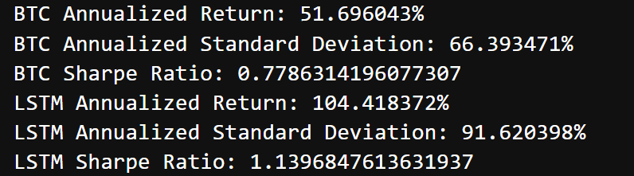
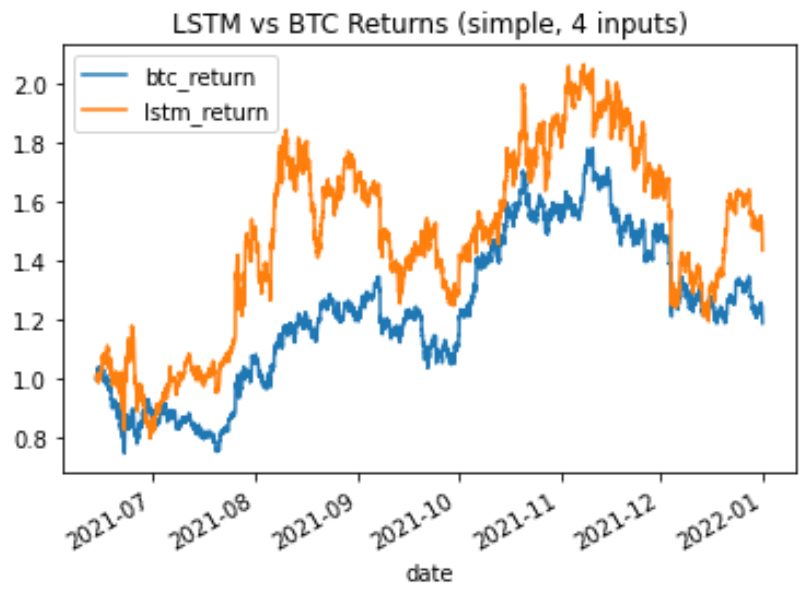
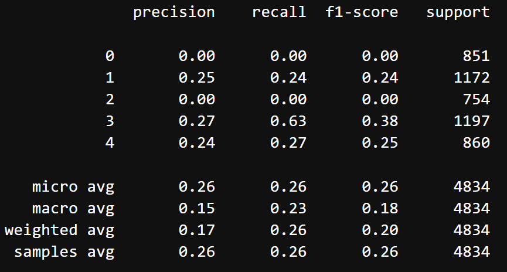

# Supervised learning techniques for Bitcoin trading strategy 

This is an attempt at an algorithmic trading strategy using supervised learning techniques to decide on the optimal position for the next 1hr return of Bitcoin.  For input data, various observable market data points, including prices and technical indicators for crypto and non-crypto assets, were utilized.  The model used was LSTM due to it's proficiency for time-series data.

## Technologies Used:
*[Pandas] (https://github.com/pandas) - Data Analysis

*[SKLearn] (https://github.com/scikit-learn) - Advanced Data Anaylsis and Machine Learning

*[TensorFlow] (https://github.com/tensorflow) - LSTM

*[Numpy] (https://github.com/numpy) - Mathematical Functions

*[GoogleColab]

*[API]  Messari and Genesis

*[hvPlot] (https://github.com/hvplot) - Interactive Plotting tools

*[Path] (https://github.com/path) - CSV File 

## Model 
-We chose a classification model over a regression model in order to focus on the decision of having a position
-There are 5 classification fields:  large short, small short, no position, small long; large long
-Recurrent Neural Networks (RNN) use output from previous intervals to inform the current interval
-We chose a **bidirectional LSTM recurrent neural network** for time series forecasting in TensorFlow

## Usage and Content
To see the analysis, pls clone the repository and open the folder **Models**.  The various models can be run in JupyterLab.  

There is also a copy of the presentation we delivered (Project Diamond Hands).

There are also .py files used for data aggregation for reference.

Here are some images from the tool:

## Contributors:

- Lee Copeland
- Vishnu Kurella
- Ahmad Sadraei
- Ling Zhou

